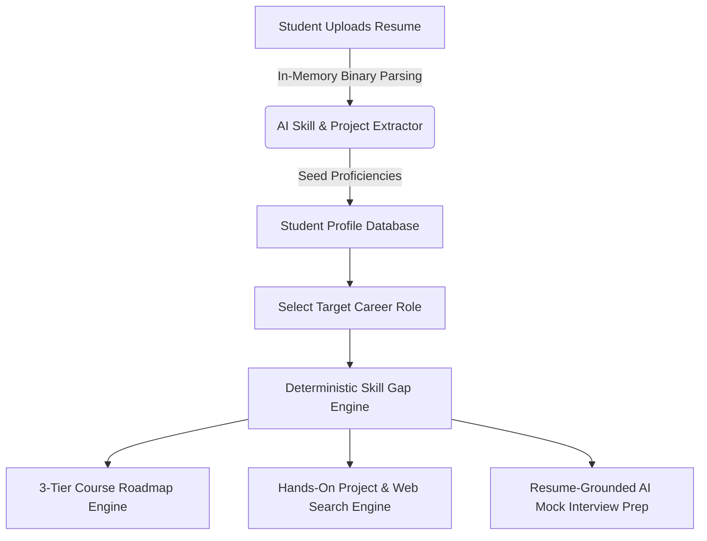
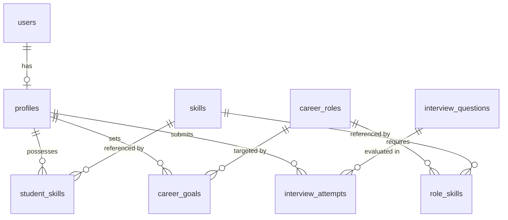

# 🚀 SkillForge: Comprehensive Architectural & Technical Documentation

---

## 📌 1. Executive Summary & Overview

**SkillForge** is an advanced, AI-powered personalized career roadmap and adaptive learning platform designed to bridge the gap between student competencies and industry hiring requirements. 

Unlike conventional static course platforms, SkillForge continuously analyzes a student's current proficiencies against target career roles (e.g. *Backend Engineer*, *Data Scientist / ML Engineer*, *Full-Stack Developer*), identifies exact skill deficits, and dynamically generates:
1. **3-Tier Structured Course Roadmaps** (Module ➔ Chapter ➔ Skill Topic).
2. **Hands-On Project Blueprints** backed by a full-internet search engine and 4-phase technology-matched implementation roadmaps.
3. **Adaptive AI Mock Interviews** grounded strictly in the student's uploaded resume projects and technical skill gaps.

---

## 🛠️ 2. Technology Stack & Component Inventory

### **Frontend Architecture**
- **Framework**: Next.js 15 (App Router, Turbopack, React 19, Server & Client Components)
- **Language**: TypeScript (Strict Mode)
- **Styling & Design System**: Vanilla CSS & Tailwind CSS with Glassmorphism UI tokens, custom HSL color palettes, and fluid micro-animations.
- **Icons & Visuals**: Lucide React Icons
- **Auth Client**: `@supabase/ssr` / Supabase Auth Client

### **Backend Architecture**
- **Framework**: FastAPI (Python 3.11)
- **ORM & Database Toolkit**: SQLAlchemy 2.0 (Async & Declarative Base)
- **Database Migration Engine**: Alembic (Versioning `0001` through `0010`)
- **Validation & Schemas**: Pydantic V2
- **Database**: PostgreSQL
- **Document Extractors**: `pypdf` (In-memory PDF parsing), `python-docx` (Word doc parsing)

### **AI Provider & Fallback Engine**
- **Primary AI Provider**: Groq Cloud API (`llama-3.3-70b-versatile` / `llama-3.8b-8192`)
- **Structured Output**: Pydantic Schema-constrained JSON generation.
- **Fail-Safe Mechanism**: Every AI module (Resume Extractor, Roadmap Generator, Recommendation Explainer, Interview Evaluator) features a 100% deterministic fallback engine that guarantees unbroken service even during LLM rate limits (HTTP 429) or network outages.

### **Search Engine & Project Engines**
- **InternetSearchEngine** (`app/services/web_search_engine.py`): Performs live web & open-source repository queries across the internet (GitHub, GitLab, developer portals, official documentation sites) to surface verified project reference links.
- **ProjectMilestoneEngine** (`app/services/project_milestones.py`): Technology and domain-aware generator that inspects project tech stacks (React, FastAPI, Pandas, ML, RAG, Algorithms) to create 4-phase implementation steps with dedicated milestone study links.

---

## ⚡ 3. End-to-End System Workflows: How SkillForge Works

### **Workflow 1: Resume Upload & Automated Skill Profiling**
1. Student uploads a `.pdf` or `.docx` resume file.
2. `extract_text_from_bytes()` parses the binary stream in-memory without storing raw files on disk.
3. Groq AI parses candidate work experience, technical projects, and skills.
4. Extracted skills are matched against the canonical `skills` database table and saved to `student_skills` with confidence-based proficiencies.

### **Workflow 2: Career Role Selection & Skill Gap Calculation**
1. Student chooses a target career role (e.g., *Backend Engineer*).
2. The `SkillGapService` retrieves the target role's required competencies (`role_skills`).
3. Calculates skill deficits for each required skill: `gap_weight = max(0, required_level - student_level)`.
4. Classifies gaps into priority buckets (*High*, *Medium*, *Low*).

### **Workflow 3: 3-Tier Course Roadmap Engine**
1. Group gap skills into logical learning modules (e.g. *Foundations*, *Core Backend*, *Advanced Systems*).
2. Divides modules into structured Chapters and actionable Topics.
3. Enriches each topic with direct study resources (`ref_url`, `ref_provider`) and interactive practice labs.

### **Workflow 4: Hands-On Projects & Full-Internet Search Engine**
1. Queries the `projects` table for hands-on portfolio projects covering the student's gap skills.
2. `InternetSearchEngine` searches the web for authentic open-source repositories and official guide URLs.
3. `ProjectMilestoneEngine` generates 4 distinct implementation phases (`Phase 1` through `Phase 4`) tailored specifically to the project's domain (ML, Web Frontend, FastAPI Backend, Data Analysis, RAG/AI).
4. Tracks milestone checkboxes and progress percentages (`0 of 4 Completed`).

### **Workflow 5: Adaptive AI Mock Interview Prep Engine**
1. Fetches candidate interview questions tailored to the student's target role and gap skills.
2. Excludes previously attempted question IDs to prevent repetition.
3. Generates project-specific questions derived directly from the student's uploaded resume projects.
4. Evaluates student responses using Groq AI, scoring them up to 100% and providing structured strengths, weaknesses, and actionable feedback.

---

## 🧮 4. Algorithmic Models & Mathematical Formulas

### **1. Deterministic Skill Gap Formula**
For any skill $s$ required by target role $R$:

$$\Delta(s) = \max\Big(0, \, \text{Proficiency}_{\text{Required}}(R, s) - \text{Proficiency}_{\text{Student}}(s)\Big)$$

**Priority Bucket Allocation**:

$$\text{Priority}(s) = \begin{cases} 
\text{High} & \text{if } \Delta(s) \ge 2 \\ 
\text{Medium} & \text{if } \Delta(s) = 1 \\ 
\text{Low} & \text{if } \Delta(s) = 0 \text{ (or not required)} 
\end{cases}$$

---

### **2. Personalized Recommendation Weighted Scoring Formula**
Every candidate item (Resource, Project, Certification) is evaluated against a student's profile and gap map:

$$\text{Score} = w_1 \cdot S_{\text{priority}} + w_2 \cdot S_{\text{difficulty}} + w_3 \cdot S_{\text{interest}} + w_4 \cdot S_{\text{coverage}}$$

Where:
- $w_1 = 3$: **Gap Priority Weight** ($\text{High}=3, \text{Medium}=2, \text{Low}=1$) based on the highest priority gap skill covered by the item.
- $w_2 = 2$: **Difficulty Fit** ($2$ if item difficulty is within $\pm 1$ of student level, else $0$).
- $w_3 = 1$: **Interest Match** ($1$ if item description matches student interests, else $0$).
- $w_4 = 1$: **Skill Coverage** ($\min(\text{count of matched gap skills}, 3)$).

$$\text{Max Score} = (3 \times 3) + 2 + 1 + 3 = 15.0$$

---

### **3. Anti-Repetition Interview Selection Algorithm**

$$\mathcal{Q}_{\text{candidate}} = \mathcal{Q}_{\text{seed}}(R) \setminus \{ q \in \mathcal{Q}_{\text{all}} \mid q.\text{id} \in \text{Attempts}_{\text{student}} \}$$

$$\mathcal{Q}_{\text{selected}} = \text{Shuffle}\big(\mathcal{Q}_{\text{technical}}\big)[:2] \, \cup \, \text{Shuffle}\big(\mathcal{Q}_{\text{behavioral}}\big)[:1] \, \cup \, \text{Shuffle}\big(\mathcal{Q}_{\text{role}}\big)[:1] \, \cup \, \mathcal{Q}_{\text{AI\_Resume\_Project}}[:1]$$

---

## 🗄️ 5. Database Schema & Architecture

### **Core Database Tables**
1. `users`: Authentication identities managed via Supabase / Auth core.
2. `profiles`: Student details, target role IDs, interests list, and experience levels.
3. `skills`: Canonical registry of 280+ software engineering skills.
4. `student_skills`: Junction table storing verified student skill proficiencies (1 to 5).
5. `career_roles`: Industry job role profiles (*Backend Engineer*, *Data Scientist*, *Full-Stack Developer*).
6. `role_skills`: Minimum required proficiencies per role.
7. `roadmap_items`: 3-tier course hierarchy nodes (`module`, `chapter`, `topic`) with resource URLs (`ref_url`).
8. `projects`: Portfolio building project definitions with direct repository URLs (`url`).
9. `interview_questions`: Technical, behavioral, role-specific, and resume-project interview questions.
10. `interview_attempts`: Historical attempt logs with AI score, strengths, weaknesses, and feedback.

---

## 🚢 6. Deployment & Environment Configuration

### **Production Infrastructure**
- **Frontend Hosting**: Vercel (Next.js App Router)
- **Backend Hosting**: Render (FastAPI / Uvicorn Service)
- **Database Hosting**: Supabase / Managed PostgreSQL

### **Operational Notes for Evaluation**
- **Render Free Tier Cold Start**: If inactive for 15+ minutes, the Render backend service enters sleep mode. The first request takes **~50–53 seconds** to initialize.
- **Email Verification**: Disabled on evaluation instances due to free-tier outbound SMTP limitations.
- **Demo Test Credentials**:
  - **Email**: `test1@gmail.com`
  - **Password**: `test1234`
